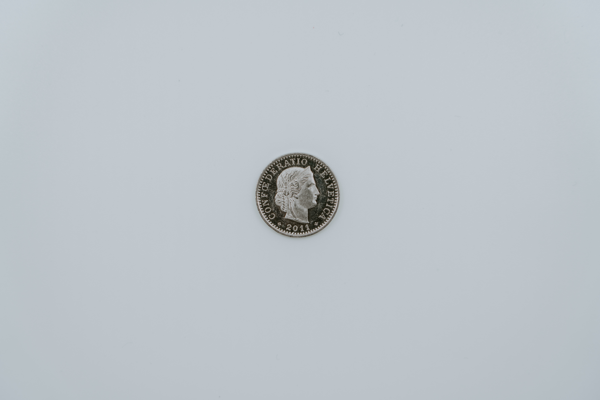

# coin-fliper

## Features: 
- flips a coin however many times you want and tells you how many in a row of heads/tails you got.
- choice of live output
- can process billions of coin flips decpite being writen in python

## Other info 
edit line 21 and get rid of the comment to see the coin outputs in real time. this slows down the execution from O(n) to O(n log n)

## inspiration
directly inspired by john fish and (asdfgh746?/Lucas Cherkewski?):
https://github.com/johnafish/flip-coin
https://github.com/johnafish https://www.youtube.com/user/MrFish235
https://github.com/lchski https://github.com/asdfgh746-snippets
